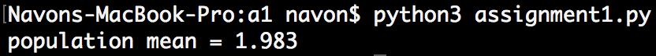

# Assignment 1 - STA4164
### Navon Francis

##### Question 1 - A
There was a limited edition set of toys, where only 6 were produced and by hand. Their weights are: W = [2.05, 1.8, 2.2, 2.15, 1.75, 1.95]
- a) Would it be correct to say we are computing the sample mean or the population mean? (1 point)
  - It would be correct to say we are computing the population mean because, we have the **entire** set of toys that were created in our population.
- b) Compute this mean by hand, or type it out but show the working. (1point)

```python
W = [2.05, 1.8, 2.2, 2.15, 1.75, 1.95]  
population_mean = sum(W) / len(W)  
print(round(population_mean, 3))```


