# Assignment 1 - STA4164
## Navon Francis

README:  
Coded using Python version 3.6.  
All the imports needed to run any code are shown below.  
If code uses input files, please make sure they are in the same directory and the names are the same (I did not alter from what the professor has given).
```
import numpy as np
import pandas as pd
import matplotlib.pyplot as plt
from scipy import stats
```

### Question 1 - A
There was a limited edition set of toys, where only 6 were produced and by hand. Their weights are: W = [2.05, 1.8, 2.2, 2.15, 1.75, 1.95]
- a) Would it be correct to say we are computing the sample mean or the population mean? (1point)
  - It would be correct to say we are computing the population mean because we have the **entire** set of toys that were created in our population.
- b) Compute this mean by hand, or type it out but show the working. (1point)

```
W = [2.05, 1.8, 2.2, 2.15, 1.75, 1.95]  
population_mean = sum(W) / len(W)  
print('population_mean =', round(population_mean, 3))  
```

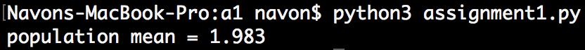

- c) Would you compute the sample variance or the population variance? (1point)
  - As stated above, we are looking at an entire population. So, we would calculate the population variance.

- d) Compute the variance by hand or type it out but show the working. (1point)

```
W = [2.05, 1.8, 2.2, 2.15, 1.75, 1.95]  
population_mean = sum(W) / len(W)  
W = [pow((i - population_mean), 2) for i in W]  
population_variance = sum(W) / len(W)  
print('population variance =', round(population_variance, 3))  
```

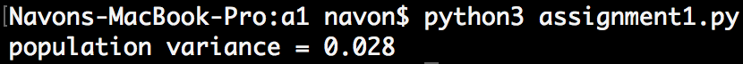

- e) What are the median and mode values? (1point)
  - median = 2.0, mode = none.

- f) Was there any skewness in the production process in terms of the weights of these toys? (2points)

```
W = [2.05, 1.8, 2.2, 2.15, 1.75, 1.95]
population_mean = sum(W) / len(W)
std_deviation = round(np.std(W), 4)
mode = 2.0
# calculating skew: (mean - mode) / std dev.
skew = (population_mean - mode) / std_deviation
print('skew =', round(skew, 4))
```
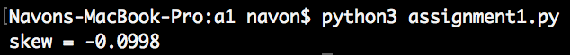
  - As we can see, yes, there is a skew in the production process in terms of weight. In particular, a skew to the left.

### Question 1 - B
Someone goes fishing and catches a bucket of fish of the same species. Their weights are:
W_fish = [1.25, 2, 1.75, 1, 1.3, 1.8, 1.7, 1.2, 1.5] Looking at pictures of fish, the expected weight of the fish in the image of a webpage is stated to be 1.65.

- a) What does the degrees of freedom refer to in the Student-T distribution? (1point)
  - Degrees of freedom in the Student's T-distribution will change what the probability distribution looks like. The degrees of freedom help us make a better estimation for the mean of our normal distribution.

- b) When would we use the student-T test over the Z score? (2points)
  - We use Student's T-distribution test over the Z score when we do **not** know the population standard deviation.

- c) What is the t-test equation? (1point)

```
t = (mean - population_mean) / (std_deviation / sqrt(n))
```

- d) Using the t-test can you test the weights of the fish caught support or reject that these fish belong to the same species seen in the catalogue? (4points)

```
W = [1.25, 2, 1.75, 1, 1.3, 1.8, 1.7, 1.2, 1.5]
t = stats.ttest_1samp(W, 1.65)
print(t)
```
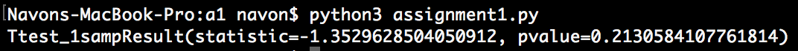
  - Our t value generated is -1.35, in which we take the absolute value - giving us 1.35. This means the sample group is 1.35 times different than what the webpage stated. Our calculated t value is less than the critical t value in the t-table, therefore we support that these fish are from the same species.

### Question 1 - C
We observe from our campus the temperature and count the number of squirrels. Our observations are:  
T = [52,52,50,54,50,52,54,80,80]  
Sq = [8,10,6,9,6,12,12,1,0]

- a) What is the covariance of these vectors? (1point)

```
T = [52,52,50,54,50,52,54,80,80]
Sq = [8,10,6,9,6,12,12,1,0]
cov_T = np.cov(T)
cov_Sq = np.cov(Sq)
print("covariance of T =", cov_T)
print("covariance of Sq =", cov_Sq)
```
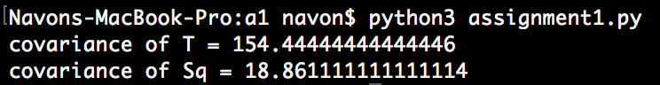

- b) What is the covariance matrix? (1point)

```
T = [52,52,50,54,50,52,54,80,80]
Sq = [8,10,6,9,6,12,12,1,0]
cov = np.cov(T, Sq)
print(cov)
```

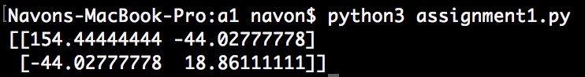

- c) What is the correlation coefficient? (1point)

```
T = [52,52,50,54,50,52,54,80,80]
Sq = [8,10,6,9,6,12,12,1,0]
# r value = correlation coefficient
correlation_coeff = np.corrcoef(T, Sq)
print("Correlation coefficient =", correlation_coeff[0][1])
```
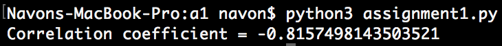

- d) Find the coefficient of determination? (1point)

```
T = [52,52,50,54,50,52,54,80,80]
Sq = [8,10,6,9,6,12,12,1,0]
# r^2 value = coefficient of determination
coeff_of_d = pow(correlation_coeff, 2)
print("Coefficient of determination =", coeff_of_d[0][1])
```


- e) Can you make any statement or conclusion given these numbers as to the relationship of these paired observations? (1point)
  - We can conclude that there is a **strong negative correlation**, when the temperature is heading in one direction (high or low) the amount of squirrels on campus with head in the opposite direction, we can gather this information by observing that the coefficient of correlation is close to -1. We can also examine that there is around 66% of the variation can be explained by the regression using our coefficient of determination.  

- f) If we try to fit a straight line model to these variables; What is the best choice for the dependent and independent variable and why? What is the slope β1? What is the intercept value β0 ? (show your working) (4points)
  - The best choice for dependent and independent variables would be squirrels and temperature, respectively, because we are observing the variation in squirrels on campus based on the temperature outside.

```
# SLOPE (β1) & INTERCEPT (β0)
T = [52,52,50,54,50,52,54,80,80]
Sq = [8,10,6,9,6,12,12,1,0]
N = 9
xy, x_2, y_2 = 0, 0, 0
# work for intercept and slope:
for i in range(0, len(T)):
    xy += T[i] * Sq[i]
    x_2 += pow(T[i], 2)
    y_2 += pow(Sq[i], 2)

slope = ((N * xy) - (sum(T) * sum(Sq))) / ((N * x_2) - pow(sum(T), 2))
inter = ((sum(Sq) * x_2) - (sum(T) * xy)) / ((N * x_2) - pow(sum(T), 2))

print("Slope =", slope)
print("Intercept =", inter)
```

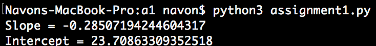

- g) Which aspect of the data is not being captured and does this affect the methodology of the straight line model used? (2points)
  - Since we are using a straight line model we are not capturing the aspect of outliers appearing in our data. For the most part, it is all uniform data, if we were to get something that appears far from the data shown it would affect our intercept and slope to be not as accurate.

- h) What is a good measure to assess the quality of the straight line fitted above? Use this measure. (1point)
  - A good measure to assess the quality of the straight line fitted is the nonparametric Chi-Square Test (for goodness of fit).

### Question 1 - D
We have a marketing manager who believes that for 1 every dollar put into advertising, 2 dollars are returned. This manager is very confident about the hypothesis. You observe the advert spending budget and sales return:  
B = [10, 20, 40, 80, 160, 320]  
S = [0, 10, 90, 150, 300, 600]

- a) Assuming a straight line model, use a test statistic to support or reject the hypothesis that the return from the budget is 2. (6points)

```
# x: budget, y: return
B = [10, 20, 40, 80, 160, 320]
S = [0, 10, 90, 150, 300, 600]
slope, intercept, r_value, p_value, std_err = stats.linregress(B, S)
print("p value =", p_value)
plt.plot(B, S, 'o', label='original data')
plt.plot(np.unique(B), np.poly1d(np.polyfit(B, S, 1))(np.unique(B)), label='fitted line')
plt.legend()
plt.show()
```
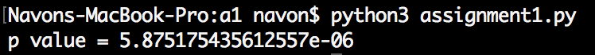

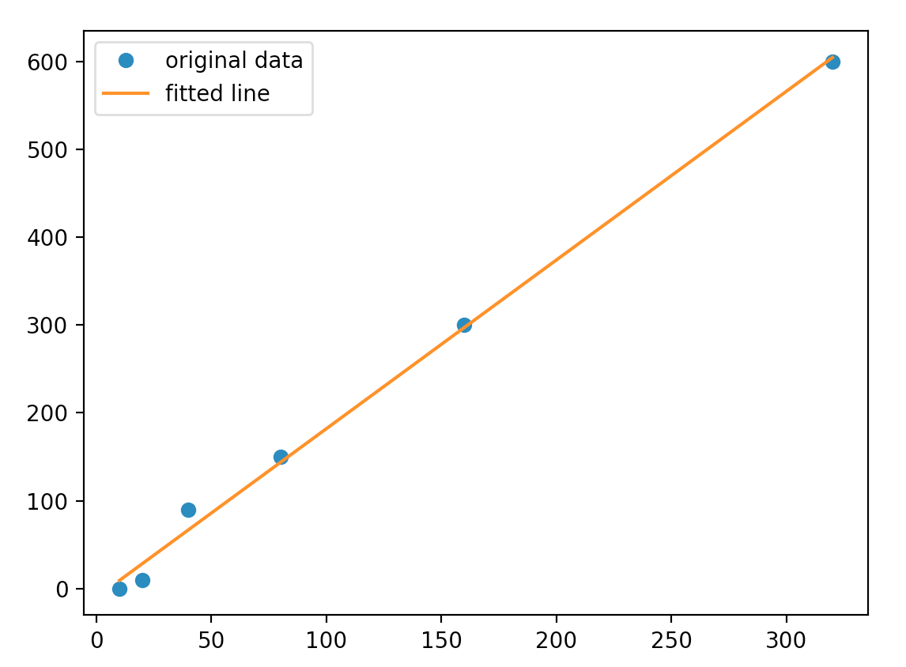

- Using the straight line model we can see that our p-value is very small, we would reject our null hypothesis - supporting that twice the amount of money is returned from the budget! Further analysis shows that there is a linear correlation between spending budget and sales return because our best fit line accurately moves across most of our data.


### Question 1 - E
A student looks their horoscope rating every morning before taking an exam. The student keeps a log of the horoscope ratings and the exam performance. This is the log:  
H = [3,4,9,10,6,7]  
E = [80, 90, 75, 95, 85, 85]  
Test if least squares regression produces a significant F statistic:  
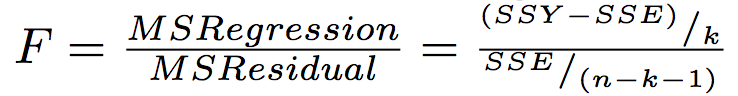

- a) What conclusion can you arrive at? (4points)

```
# Calculate F statistic
H = [3,4,9,10,6,7]
E = [80, 90, 75, 95, 85, 85]
N = 6
k = 1 # one input parameter, horoscope score
XY = sum([H[i] * E[i] for i in range(0, N)])
SSXY = XY - ((sum(H) * sum(E)) / N)
SSX = sum([i * i for i in H])
SSXX = SSX - (pow(sum(H), 2) / N)
beta1 = SSXY/SSXX
SSY = sum([i * i for i in E])
SSYY = SSY - (pow(sum(E), 2)/N)
SSE = SSYY - (beta1 * SSXY)
# our final F equation, as seen above
F = ((SSY - SSE) / k) / (SSE / (N - k - 1))
print("F =", round(F, 3))
```

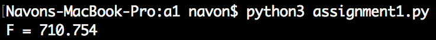

```
# plot the data, finding best fit line, x: horoscope score, y: exam grade
H = [3,4,9,10,6,7]
E = [80, 90, 75, 95, 85, 85]
slope, intercept, r_value, p_value, std_err = stats.linregress(H, E)
print("p value =", p_value)
plt.plot(H, E, 'o', label='original data')
plt.plot(np.unique(H), np.poly1d(np.polyfit(H, E, 1))(np.unique(H)), label='fitted line')
plt.legend()
plt.show()
```
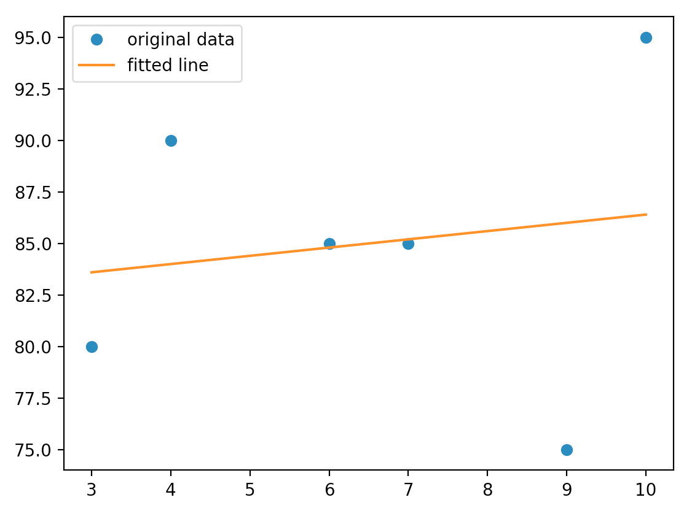

- Our conclusion we arrive at is that the data is not statistically significant.

### Question 2 - A

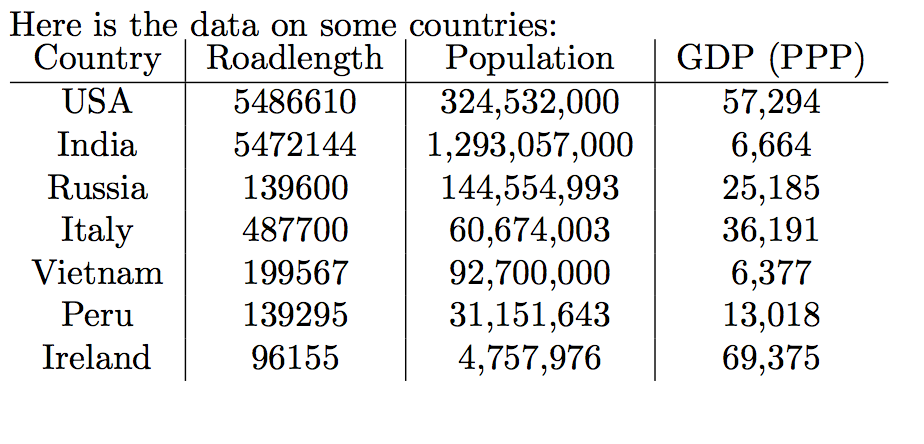

Using SAS or Python, analyze this data in
produce some insight. Possibilities include correlation coefficients, F statistics, the slopes, the number of dependent variables, or even finding more data on each country to include in the table that will add to the regression. You can choose the dependent variable among these 3. It is possible to go through the results of straight line regression and interpret the results with figures. (6 points)

```
# GDP affected by population, x: population, y: gdp
pop = [324532000, 1293057000, 144554993, 60674003, 92700000, 31151643, 4757967]
gdp = [57294, 6664, 25185, 36191, 6377, 13018, 69375]
labels = ["USA", "India", "Russia", "Italy", "Vietnam", "Peru", "Ireland"]
slope, intercept, r_value, p_value, std_err = stats.linregress(pop, gdp)
print("p value =", p_value)
plt.plot(pop, gdp, 'o', label='original data')
plt.plot(np.unique(pop), np.poly1d(np.polyfit(pop, gdp, 1))(np.unique(pop)), label='fitted line')
plt.legend()
for i in range(0, len(pop)):
    plt.annotate(
        labels[i],
        xy=(pop[i], gdp[i]), xytext=(40, 10),
        textcoords='offset points', ha='right', va='bottom',
        bbox=dict(boxstyle='round,pad=0.5', fc='yellow', alpha=0.5),
        arrowprops=dict(arrowstyle = '->', connectionstyle='arc3,rad=0'))
plt.show()
```
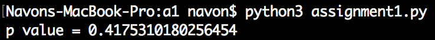  

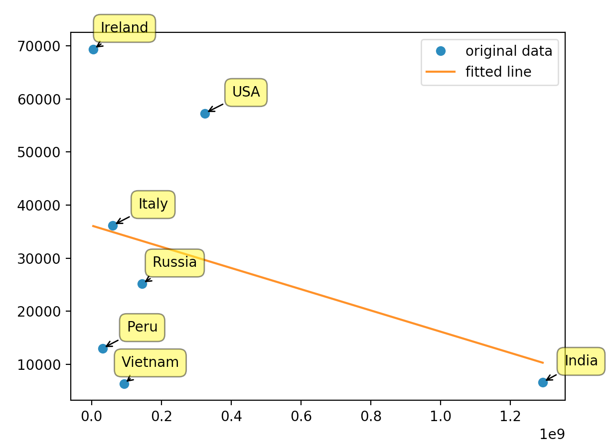
- As we can see, we have analyzed this data using a straight line model. For this observation we will look at the how does the population of a country affects the GDP (PPP). Let's state that our null hypothesis: GDP is affected by population. Processing the data to create a linear regression model. We can look at our p value to see how this affects our null hypothesis, since the p value is very large we would not reject our null hypothesis! There is insufficient evidence to show that the population affects the GDP (PPP).

- In a linear regression outliers affect our model heavily, so I took out India just for fun to see what are best fit line would look like. As we can see, the line completely changed from negative to a positive slope. A straight line model is really good at showing what outliers affect our data, which was India.

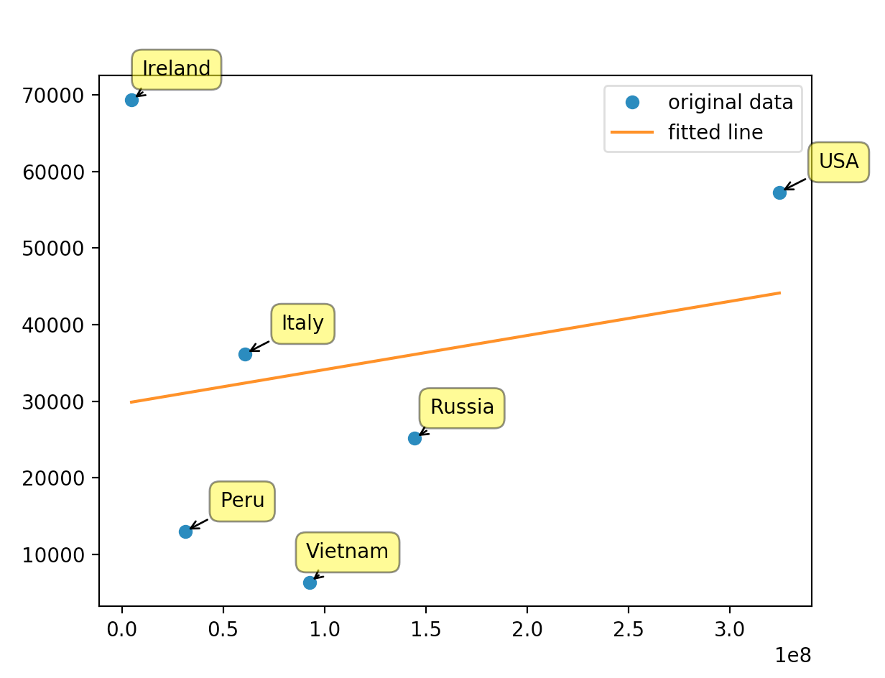  

### Question 2 - B
You have 2 CSV files with the prices of Bitcoin (BTC).  
a) Find the mean and standard error for the prices in each file (4 points)  
```
data_one_month = pd.read_csv('coindesk-USD-BTC-data-2018-01-24_2018-02-08.csv', header=None)
data_two_year = pd.read_csv('coindesk-USD-BTC-data-2016-02-07_2018-02-08.csv', header=None)

print("Mean of one month data =", round(data_one_month[1].mean(), 3))
print("Std error of one month data =", round(data_one_month[1].sem(), 3))
print("Mean of two year data =", round(data_two_year[1].mean(), 3))
print("Std error of two year data =", round(data_two_year[1].sem(), 3))
```


b) Using the mean of the 2 year prices, compare it to that of the data in the 2018-01-24 to 2018-02-08 with a one sample T-test. What conclusion can you arrive at? (3 points)

```
data_one_month = pd.read_csv('coindesk-USD-BTC-data-2018-01-24_2018-02-08.csv', header=None)
data_two_year = pd.read_csv('coindesk-USD-BTC-data-2016-02-07_2018-02-08.csv', header=None)

mean_two_year = data_two_year[1].mean()
one_sample = stats.ttest_1samp(data_one_month[1], mean_two_year)
print(one_sample)
```
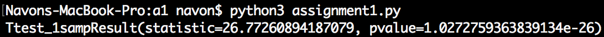

- In this case we will reject our null hypothesis of m = μ. There is insufficient evidence to indicate that the mean of the two year bitcoin data is equal to the mean of the one month bitcoin data. In other words, the price of bitcoin has skyrocketed in recent time, as prices of the latest one month data are significantly higher than the two year data.
